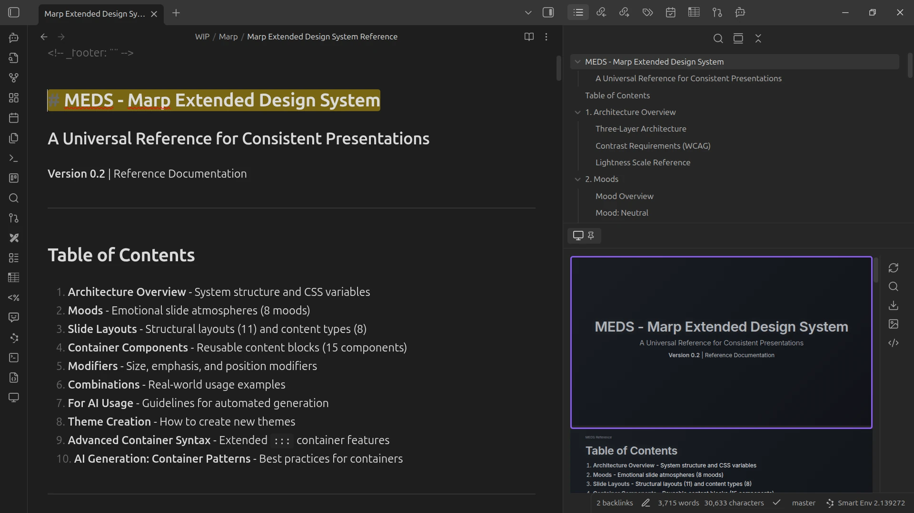
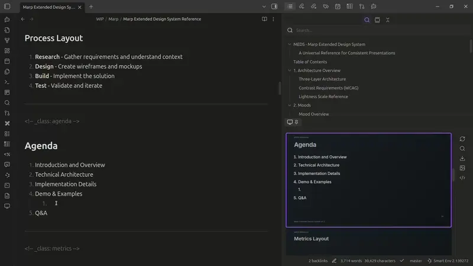
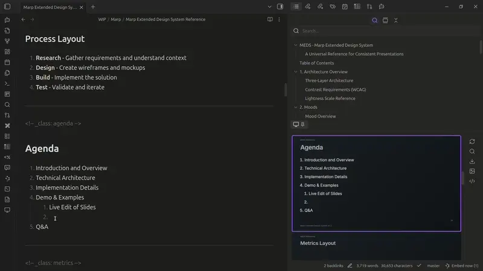
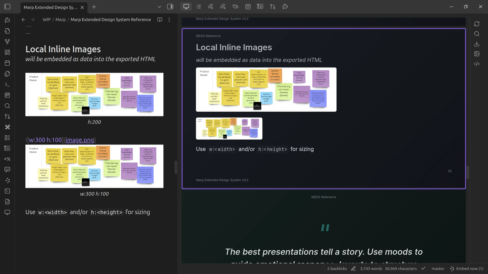
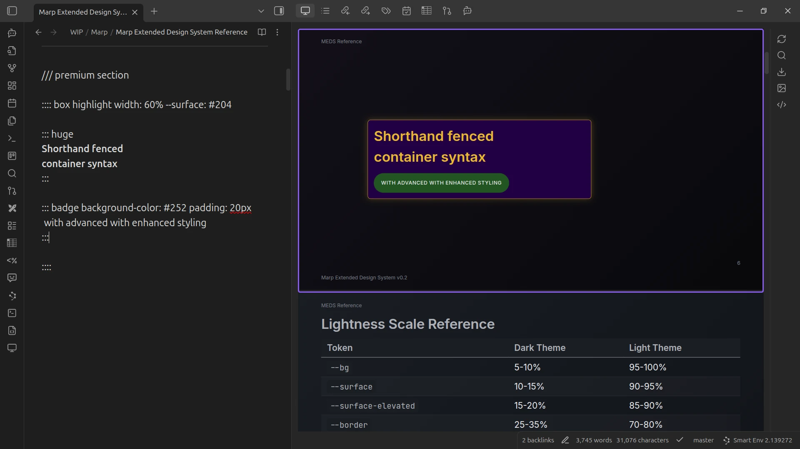
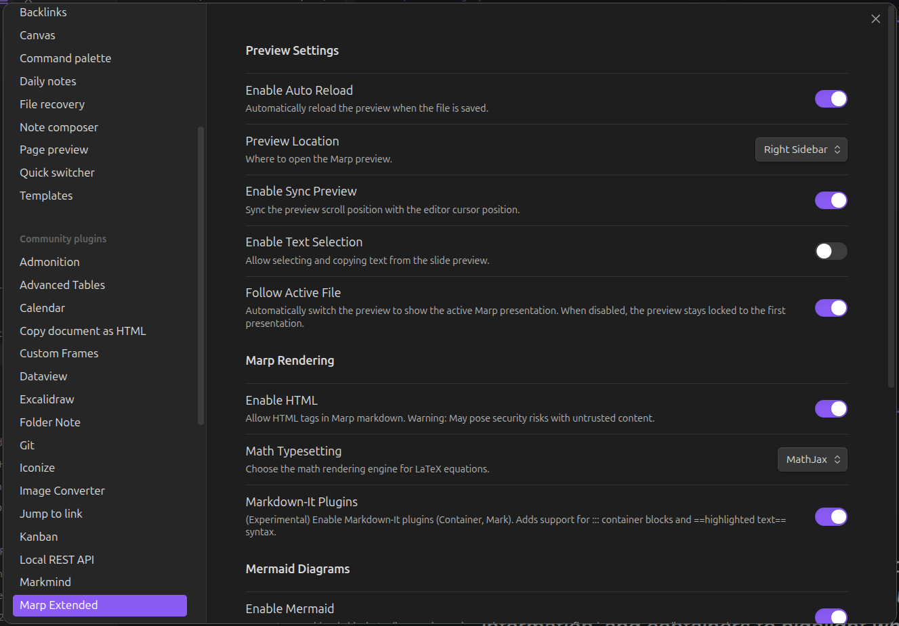

# Marp Extended

Create [beautiful slide presentations](https://mhenze-exaring.github.io/marp-extended-plugin/Marp%20Extended%20Design%20System%20Reference.html) using [Marp](https://marp.app/) directly within [Obsidian](https://obsidian.md/). This plugin provides live preview, export capabilities, bidirectional editor sync, Mermaid diagram support, and extended Markdown syntax for professional presentations.



> **Note**: While this plugin is based on JichouP's Marp plugin, it uses a separate plugin ID (`marp-extended`), so you can install both, if you like.

## Features

### Sidebar Preview

By default the preview opens in the sidebar and previews Marp presentations opened in the main editor.
The preview can be opened in the sidebar, a split pane, or a separate tab.


### Live Editing

Changes to your presentation's markdown file are reflected in the preview while editing.



### Bidirectional sync

Clicking a slide navigates to that section in the editor, and moving the cursor syncs the preview.



### Mermaid Diagrams

Embed Mermaid diagrams directly in your slides. Diagrams are rendered to SVG and cached for performance.

Optional sizing: `w:400` (width) or `h:300` (height) in pixels or percentages.


### Local Images

You can include local images from your vault.

Optional sizing: `w:400` (width) or `h:300` (height) in pixels or percentages.



Use Obsidian's native image syntax - both formats work:

```markdown
![[path/to/image.png]]

```

### Export to PDF, PPTX, HTML

Export your presentations to multiple formats. Images are automatically embedded as Base64, making your exports self-contained and shareable.

**Requires Node.js** - The plugin uses `npx @marp-team/marp-cli` for export.

### Extended Markdown Syntax

> **Note**: These features require enabling "Extended Markdown Plugins" in settings.
 
 


#### Directive Shorthand (`///`)

Quick syntax for Marp directives instead of HTML comments:

```markdown
/// lead paginate:skip

# My Title Slide
```

Expands to:
```html
<!-- _class: lead -->
<!-- _paginate: skip -->
```

#### Container Blocks (`:::`)

Create styled containers with flexible syntax:

```markdown
:::: columns

::: col
Left column content
:::

::: col
Right column content
:::

::: highlight#important background: yellow
Highlighted content with class, ID, and inline styles
:::
```

#### Mark/Highlight (`==text==`)

Highlight text with double equals:

```markdown
This is ==highlighted== text.
```

Renders as `<mark>highlighted</mark>`.

### Custom Themes

Load custom CSS themes from your vault:

1. Create a theme folder (default: `MarpTheme/`)
2. Add your `.css` theme files
3. Use `theme: your-theme` in frontmatter
4. Optional: Click the reload button in the preview, when changing `.css` file contents

```
your-vault/
└── MarpTheme/
    ├── meds-reference-v0.2.css
    ├── space-v0.2.css
    ├── custom.css
    └── corporate.css
```

> **Note**: you can import themes and just override your settings. See [space-v0.2.css](themes/space-v0.2.css)
> as example


### Math Typesetting

Render mathematical equations with MathJax (default) or KaTeX:

```markdown
Inline: $E = mc^2$

Block:
$$
\int_0^\infty e^{-x^2} dx = \frac{\sqrt{\pi}}{2}
$$
```

## Settings

### Preview Settings

| Setting | Default   | Description |
|---------|-----------|-------------|
| Auto Reload | `true`    | Automatically reload preview when file is saved |
| Preview Location | `sidebar` | Where to open preview: `sidebar`, `split`, or `tab` |
| Sync Preview | `true`    | Sync preview with editor cursor position |
| Text Selection | `true`   | Allow selecting text in the preview |
| Follow Active File | `true`    | Automatically switch preview when changing files |

### Theme Settings

| Setting | Default | Description |
|---------|---------|-------------|
| Theme Directory | `MarpTheme` | Folder in vault containing custom CSS themes |

### Marp Rendering Options

| Setting | Default | Description |
|---------|---------|-------------|
| Enable HTML | `true` | Allow HTML tags in slides |
| Math Typesetting | `mathjax` | Math engine: `mathjax`, `katex`, or disabled |
| Extended Markdown Plugins | `true` | Enable `///`, `:::`, and `==highlight==` syntax |

### Mermaid Settings

| Setting | Default | Description |
|---------|---------|-------------|
| Enable Mermaid | `true` | Render Mermaid diagrams in preview |
| Mermaid Theme | `default` | Theme: `default`, `dark`, `forest`, `neutral`, `base` |

### Export Settings

| Setting | Default | Description |
|---------|---------|-------------|
| Export Path | (empty) | Custom export directory (empty = Downloads folder) |
| Chrome Path | (empty) | Custom Chrome/Chromium path for PDF export |

## Creating Presentations

Add `marp: true` to your frontmatter to enable Marp:

```markdown
---
marp: true
theme: default
paginate: true
---

# Slide 1

Content for the first slide

---

# Slide 2

Use `---` to separate slides
```

## CLI Tool

This plugin includes a standalone CLI for processing Marp presentations outside of Obsidian:

```bash
# Build the CLI
npm run build:cli

# Basic usage
marp-extended export presentation.md

# Export as PDF with extended features
marp-extended export presentation.md --format pdf --unsafe

# See all options
marp-extended --help
```

The CLI supports the same extended syntax (`///`, `:::`, `==highlight==`) and can render Mermaid diagrams using `mmdc` (mermaid-cli).

Configuration can be provided via `marp-extended.config.json` in the project directory.

## Requirements

- **Obsidian** v1.0.0 or later
- **Node.js** (for export functionality)
- **Chrome/Chromium** (for PDF/PPTX export)

### Optional

- **mmdc** (mermaid-cli) - for Mermaid diagram rendering in CLI exports
- **java** + **plantuml.jar** - for PlantUML support (experimental)

## Installation

### From Obsidian Community Plugins

1. Open Settings > Community Plugins
2. Search for "Marp Extended"
3. Click Install, then Enable

### Manual Installation

1. Download the latest release from GitHub
2. Extract to your vault's `.obsidian/plugins/marp-extended/` folder
3. Enable the plugin in Obsidian settings

## Development

See [docs/DEVELOPMENT.md](docs/DEVELOPMENT.md) for:
- Building from source
- Local deployment
- Running tests
- Project structure

See [docs/ARCHITECTURE.md](docs/ARCHITECTURE.md) for technical architecture documentation.

## License

MIT License - see [LICENSE](LICENSE) for details.

## Credits

- Original plugin: [JichouP/obsidian-marp-plugin](https://github.com/JichouP/obsidian-marp-plugin)
- Built on [Marp](https://marp.app/) by the Marp team
- Extended by [Mathias Henze](https://github.com/mhenze-exaring) & [Claude](https://claude.ai)
