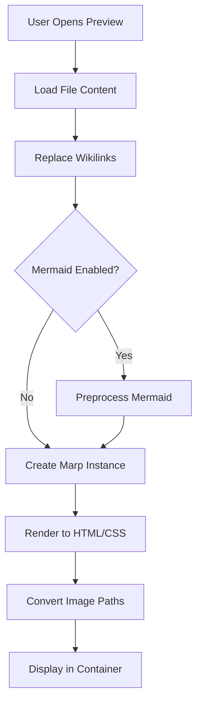
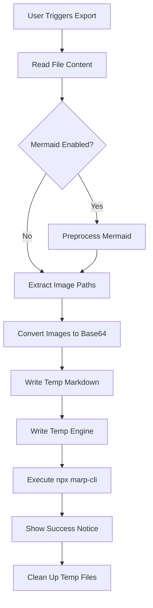
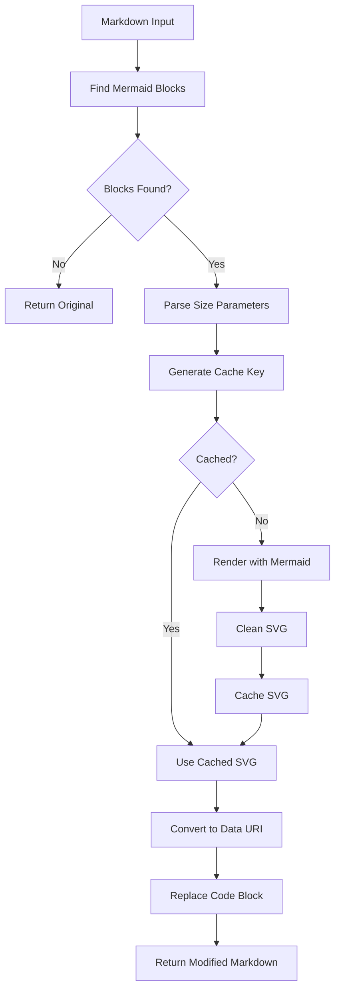
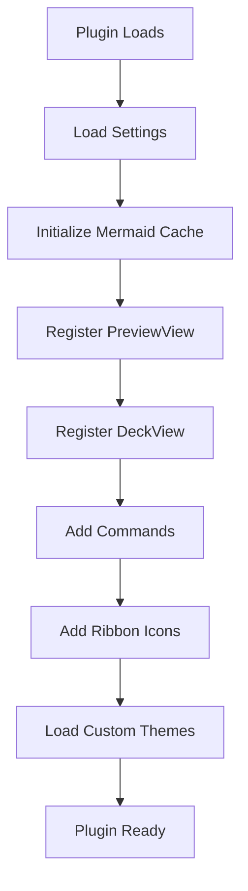

# Obsidian Marp Plugin - Architecture Documentation

## Feature Overview

| Feature | Description | Implementation |
|---------|-------------|----------------|
| **Live Preview** | Real-time Marp slide preview within Obsidian | `preview.ts`, `deckView.ts` |
| **Deck View** | Alternative preview with sidebar toolbar support | `deckView.ts` |
| **Export** | Export slides to PDF, PPTX, HTML via marp-cli | `export.ts` |
| **Wikilink Images** | Native `![[image.png]]` syntax support | `preview.ts`, `deckView.ts` |
| **Custom Themes** | Load custom CSS themes from vault | `main.ts`, `deckView.ts` |
| **Auto-Reload** | Automatic preview refresh on file save | `preview.ts`, `deckView.ts` |
| **Mermaid Diagrams** | Convert Mermaid code blocks to inline SVGs | `mermaidCache.ts` |
| **Markdown-It Plugins** | Container blocks and highlight syntax | `markdownItPlugins.ts` |
| **Math Typesetting** | MathJax/KaTeX equation rendering | `settings.ts`, `marp.ts` |
| **Marp Detection** | Auto-detect presentations via frontmatter | `deckView.ts` |

---

## Core Concepts

### 1. Dual View Architecture

The plugin provides two distinct view types:

- **PreviewView** (`preview.ts`): Traditional preview with header actions
- **DeckView** (`deckView.ts`): Enhanced preview with sidebar toolbar, better for docked usage

Both views share common functionality but DeckView adds:
- Sidebar-aware toolbar that shows/hides based on position
- Auto-load Marp presentations when switching files
- Marp browser integration for enhanced rendering

### 2. External Export via npx

Exports use `npx @marp-team/marp-cli@latest` as an external process. This is **intentional** to avoid Electron security restrictions that block dynamic imports via `file://` protocol.

**Do NOT attempt to bundle marp-cli into the plugin.**

### 3. Wikilink Image Conversion

The plugin converts Obsidian's native wikilink syntax to standard Markdown:

```
![[image.png]] → 
```

This happens in `replaceImageWikilinks()` method in both view classes.

### 4. Mermaid Diagram Caching

Mermaid diagrams are preprocessed and cached:
1. Parse markdown for `mermaid` code blocks
2. Render to SVG using Mermaid library
3. Convert SVG to base64 data URI
4. Replace code block with `` tag
5. Cache SVG by content hash

### 5. Markdown-It Plugin Embedding

Custom Markdown-It plugins are compiled at build time and embedded as strings:
1. ESBuild compiles `markdownItPlugins.ts` separately
2. Output is stored as a string constant
3. Injected into marp-cli engine at runtime via `engine.ts`

---

## Source Structure

```
src/
├── main.ts              # Plugin entry point
├── preview.ts           # PreviewView component
├── deckView.ts          # DeckView with sidebar toolbar
├── export.ts            # Export via npx marp-cli
├── marp.ts              # Marp instance factory
├── engine.ts            # Custom marp-cli engine
├── mermaidCache.ts      # Mermaid SVG caching
├── markdownItPlugins.ts # Container & mark plugins
├── settings.ts          # Settings interface
├── settingTab.ts        # Settings UI
└── convertImage.ts      # Image path resolution
```

---

## Module Responsibilities

### main.ts (Plugin Entry)

**Responsibilities:**
- Plugin lifecycle (`onload`, `onunload`)
- Command registration
- Ribbon icon setup
- View registration
- Theme loading from vault
- Mermaid cache initialization

**Key Methods:**
- `activateView(file)` - Open PreviewView for file
- `activateDeckView(file)` - Open DeckView for file
- `loadSettings()` / `saveSettings()` - Persist settings
- `onMermaidThemeChange()` - Handle theme changes

### preview.ts (Preview View)

**Responsibilities:**
- Render Marp slides in ItemView
- Convert wikilink images
- Handle auto-reload on file changes
- Provide export actions in header

**Key Methods:**
- `replaceImageWikilinks(markdown)` - Convert `![[]]` to ``
- `renderPreview()` - Render markdown to slides
- `onChange()` - Handle file modifications
- `addActions()` - Add header export buttons

### deckView.ts (Deck View)

**Responsibilities:**
- Enhanced preview with Marp browser
- Sidebar-aware toolbar
- Auto-load Marp presentations
- Theme loading per-instance

**Key Methods:**
- `createMarpInstance()` - Create Marp with current settings
- `isMarpPresentation(file)` - Check frontmatter for `marp: true`
- `resolveHtmlImagePaths(html, fileDir)` - Fix relative image paths
- `isInSidebar()` / `updateToolbarVisibility()` - Toolbar management
- `scrollToSlide(index)` - Navigate to specific slide

### export.ts (Export Handler)

**Responsibilities:**
- Execute marp-cli via npx
- Convert images to base64 for embedding
- Manage temporary files
- Apply Mermaid preprocessing

**Key Flow:**
1. Read file content
2. Preprocess Mermaid diagrams
3. Convert images to base64
4. Write temp files (markdown + engine)
5. Execute `npx @marp-team/marp-cli`
6. Clean up temp files

### marp.ts (Marp Factory)

**Responsibilities:**
- Maintain default Marp instance for themes
- Create configured Marp instances
- Copy themes between instances

**Key Functions:**
- `marp` - Default singleton for theme loading
- `createMarpInstance(options)` - Factory with HTML option

### engine.ts (Custom Engine)

**Responsibilities:**
- Generate custom marp-cli engine code
- Enable data URL validation
- Optionally embed Markdown-It plugins

**Key Function:**
- `getEngine(enablePlugins)` - Returns engine JavaScript as string

### mermaidCache.ts (Mermaid Handler)

**Responsibilities:**
- Parse mermaid code blocks with sizing
- Render diagrams to SVG
- Cache rendered SVGs by hash
- Convert to base64 data URIs

**Key Methods:**
- `preprocessMarkdown(markdown)` - Main entry point
- `render(code)` - Render single diagram
- `svgToDataUri(svg)` - Convert for embedding

**Sizing Syntax:**
```markdown

```

### markdownItPlugins.ts (MD Extensions)

**Contains:**
- `genericContainerPlugin` - `:::` container blocks with flexible syntax
- `markPlugin` - `==highlighted==` text support

**Container Syntax:**
```markdown
::: columns
content
:::

::: span.highlight#id style: value
content
:::
```

### settings.ts (Settings Model)

**Settings Categories:**
- Preview: `autoReload`, `createNewSplitTab`, `enableSyncPreview`
- Theme: `themeDir`
- Rendering: `enableHTML`, `mathTypesetting`, `enableMarkdownItPlugins`
- Mermaid: `enableMermaid`, `mermaidTheme`
- Export: `exportPath`, `chromePath`

### settingTab.ts (Settings UI)

Organizes settings into sections:
1. Preview Settings
2. Marp Rendering
3. Mermaid Diagrams
4. Theme Settings
5. Export Settings

### convertImage.ts (Image Utilities)

**Responsibilities:**
- Resolve image paths (vault-relative, absolute, URLs)
- Convert images to base64
- Process HTML for image path resolution

**Key Functions:**
- `convertToBase64(path, fileDir)` - For export embedding
- `convertHtml(html, fileDir)` - Fix paths in rendered HTML

---

## Data Flow Diagrams

### Preview Rendering Flow



### Export Flow



### Mermaid Processing Flow



### View Initialization Flow



---

## Key Design Decisions

### Why External Export?

| Approach | Pros | Cons |
|----------|------|------|
| **npx (current)** | Works reliably, full filesystem access | Requires Node.js installed |
| Bundled marp-cli | No external dependencies | Blocked by Electron security |

### Why Dual Views?

- **PreviewView**: Simple, uses standard Obsidian header actions
- **DeckView**: Advanced, sidebar-aware toolbar for docked usage

### Why Mermaid Caching?

Mermaid rendering is expensive. Caching by content hash:
- Avoids re-rendering unchanged diagrams
- Persists across preview refreshes
- Clears when theme changes

### Why Embedded Plugins?

Markdown-It plugins are compiled at build time because:
- marp-cli runs as external process
- Cannot import from bundled plugin
- String injection allows runtime plugin loading

---

## Build System

### ESBuild Configuration

```javascript
// Key configuration in esbuild.config.mjs
{
  entryPoints: ['src/main.ts'],
  bundle: true,
  format: 'cjs',
  external: ['obsidian', 'electron', ...builtins],
  plugins: [markdownItPluginsPlugin],
}
```

### Markdown-It Plugin Compilation

1. `markdownItPlugins.ts` compiled separately
2. Output stored as string constant
3. Virtual module `markdown-it-plugins-string` provides access
4. `engine.ts` imports and embeds in engine code

---

## Dependencies

### Production

| Package | Purpose |
|---------|---------|
| `@marp-team/marp-core` | Marp rendering engine |
| `fix-path` | Fix PATH for macOS GUI apps |
| `mermaid` | Diagram rendering |
| `mime` | MIME type detection |

### Development

- TypeScript, ESBuild, ESLint, Prettier
- Obsidian type stubs

---

## File Locations

| File Type | Location |
|-----------|----------|
| Plugin output | `main.js` (project root) |
| Custom themes | `{vault}/MarpTheme/*.css` |
| Exports | `~/Downloads/` (default) |
| Temp files | `~/Downloads/*.tmp` |
